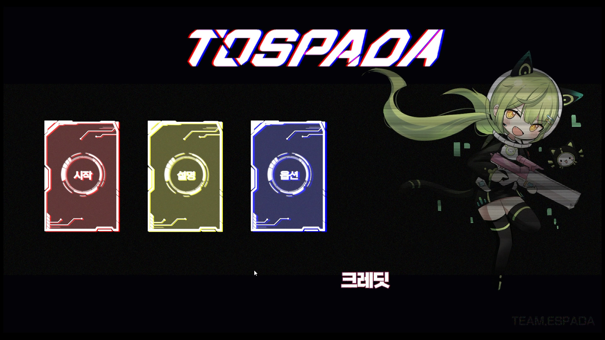
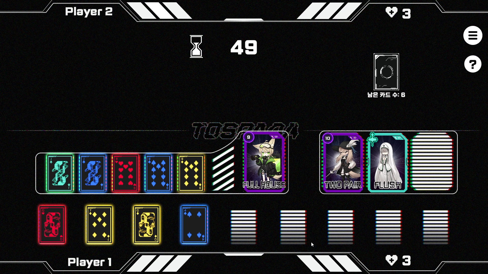
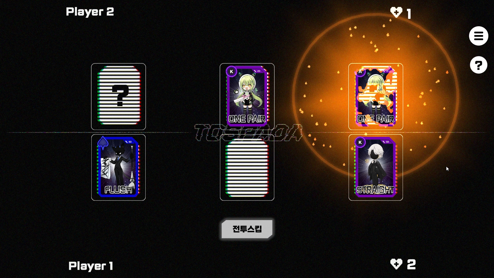

# TOSPADA

  

Unity 기반의 2D 카드 전략 게임

포커의 족보 규칙을 기반으로 카드를 조합하고, 상대와의 승부를 통해 게임을 진행하는 PC 플랫폼 게임입니다.

졸업 프로젝트로 게임 기획과 클라이언트 프로그래밍을 함께 담당했습니다.

---

## 프로젝트 소개

TOSPADA는 포커의 족보 규칙을 게임의 핵심 시스템으로 활용한 2D 카드 게임입니다.

플레이어는 게임 중 카드를 선택하고 조합하여 다양한 포커 족보를 만들 수 있으며, 완성된 카드 조합을 바탕으로 상대와 경쟁합니다.

카드 선택과 조합 과정이 게임 플레이의 전략적인 선택으로 이어지도록 게임의 규칙과 플레이 흐름을 설계했습니다.

| 항목 | 내용 |
| --- | --- |
| 플랫폼 | PC |
| 개발 엔진 | Unity |
| 개발 언어 | C# |
| 개발 기간 | 2023.03.01 ~ 2023.09.01 |
| 개발 인원 | 총 4명 |
| 팀 구성 | 아트 3명 / 기획·프로그래밍 1명 (본인) |

---

## Gameplay

플레이어는 손에 든 카드를 선택해 포커 족보를 완성하고, 완성된 족보로 상대와 승부를 겨룹니다.

| 카드 조합 | 카드 전투 |
| :---: | :---: |
|  |  |
| 카드를 선택해 포커 족보를 완성하는 단계 | 완성한 족보로 상대와 승부하는 단계 |

  
게임 플레이 영상은 아래 이미지를 클릭하면 확인할 수 있습니다.

[TOSPADA Gameplay Video](https://www.youtube.com/watch?v=RJ1uljOHJCw&utm)

---

## Download

게임 실행파일은 아래 링크에서 다운로드 할 수 있습니다.

**Windows**

[Download for Windows](https://drive.google.com/file/d/1zvfu38_7ixoJsuSYehwvt26DPWS3q7uM/view)

**macOS**

[Download for macOS](https://drive.google.com/file/d/1fpbHJBM-X1aVQ4_rocC40X9PYiJJj0Vv/view)

---

## My Role

### Game Design

- 포커 족보를 기반으로 한 게임 규칙 설계
- 게임의 기본 플레이 흐름 및 승패 구조 설계
- 카드 선택과 조합을 활용한 게임 플레이 구조 기획
- 플레이어와 적의 대결 구조 설계

### Client Programming

- 카드 데이터 및 카드 오브젝트 구현
- 포커 족보 판정 시스템 구현
- 플레이어 및 적의 게임 진행 로직 구현
- 게임 전체 진행 시스템 구현
- 카드 선택 및 필드 시스템 구현
- 게임 결과 처리
- UI 및 사운드 관련 기능 구현

---

# 주요 구현 기능

## 카드 시스템

게임의 핵심 요소인 카드를 게임 내 데이터와 오브젝트로 관리했습니다.

카드의 숫자와 문양 정보를 기반으로 플레이어와 적이 카드를 활용할 수 있도록 구현했으며, 선택된 카드 조합은 별도의 족보 판정 시스템에서 처리하도록 구성했습니다.

**관련 코드**

- [Card.cs](https://github.com/Thispring/TOSPADA/blob/main/Script/Card.cs)
- [UnitCard.cs](https://github.com/Thispring/TOSPADA/blob/main/Script/UnitCard.cs)
- [Field.cs](https://github.com/Thispring/TOSPADA/blob/main/Script/Field.cs)

---

## 포커 족보 판정

선택한 카드 조합을 분석하여 포커 족보를 판정하는 시스템을 구현했습니다.

카드의 숫자와 문양 정보를 바탕으로 Pair, Two Pair, Straight, Flush, Full House 등 다양한 족보를 판별하고, 게임 결과 계산에 활용했습니다.

**관련 코드**

- [PokerChecker.cs](https://github.com/Thispring/TOSPADA/blob/main/Script/PokerChecker.cs)

---

## 플레이어 및 적 시스템

플레이어의 카드 선택과 게임 진행 로직을 구현하고, 적이 게임의 흐름에 따라 행동할 수 있도록 별도의 적 시스템을 구성했습니다.

플레이어와 적의 행동을 각각 관리하면서 게임 진행 과정에서 카드 시스템과 연동되도록 구현했습니다.

**관련 코드**

- [Player.cs](https://github.com/Thispring/TOSPADA/blob/main/Script/Player.cs)
- [Enemy.cs](https://github.com/Thispring/TOSPADA/blob/main/Script/Enemy.cs)

---

## 게임 진행 시스템

카드 배분, 플레이어와 적의 행동, 족보 판정, 게임 결과 처리 등 게임의 전체 흐름을 관리하는 시스템을 구현했습니다.

각 게임 시스템이 진행 상황에 따라 순서대로 동작할 수 있도록 관리했습니다.

**관련 코드**

- [Manager.cs](https://github.com/Thispring/TOSPADA/blob/main/Script/Manager.cs)
- [Dealer.cs](https://github.com/Thispring/TOSPADA/blob/main/Script/Dealer.cs)
- [Result.cs](https://github.com/Thispring/TOSPADA/blob/main/Script/Result.cs)

---

# 사용 기술

| 기술 | 활용 |
| --- | --- |
| Unity | 게임 클라이언트 개발 |
| C# | 게임 로직 및 시스템 구현 |
| Unity UI | 게임 화면 및 인터페이스 구현 |

---

> 본 리포지토리는 포트폴리오 공개를 목적으로 프로젝트의 스크립트 코드만 포함하고 있습니다.
>
> 게임 에셋 및 전체 프로젝트 파일은 포함되어 있지 않습니다.
